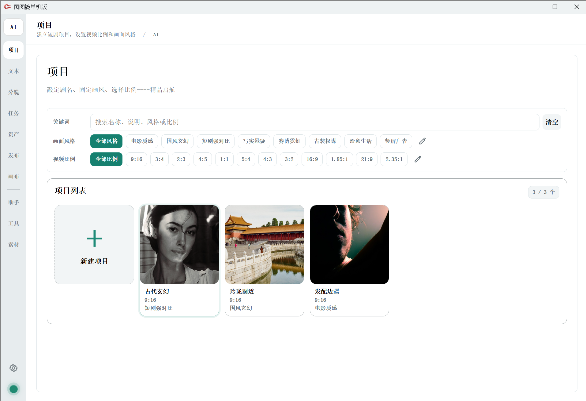
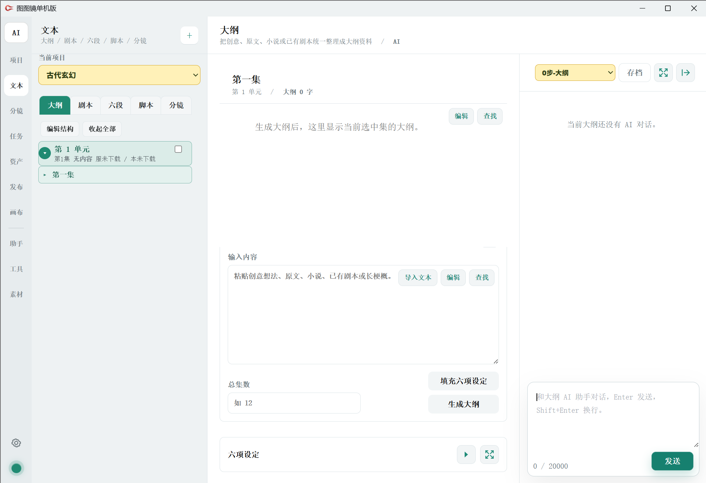
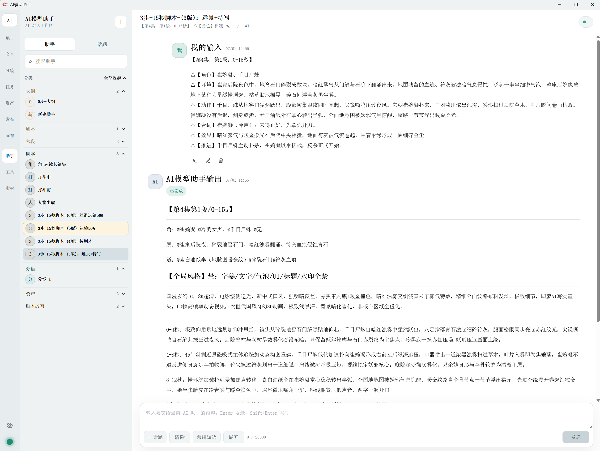
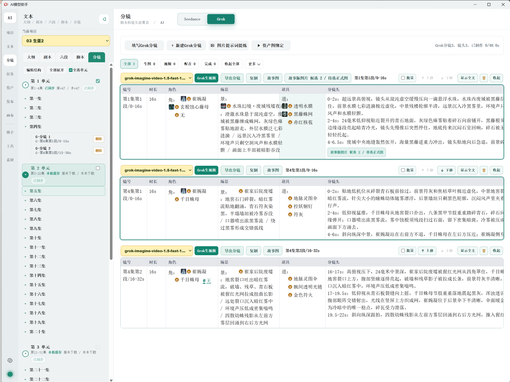
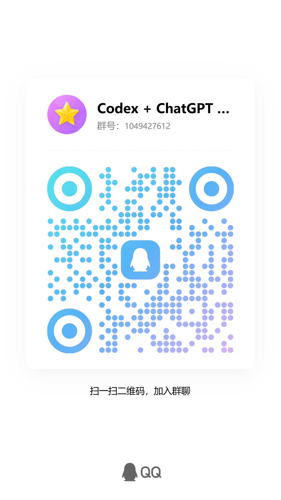

# 图图镜服务器版

图图镜服务器版是面向自有服务器部署的 Web 工作台和本体服务发布包，适合短剧、漫剧和视频创作团队在浏览器中使用项目管理、文本创作、分镜、AI 助手、素材管理、任务执行和模型 API 配置等功能。

## 下载

打开右侧或顶部的 **Releases**，下载最新附件：

`tutujing-server-v3.7.53.zip`

解压后目录名为 `图图镜服务器版`。

## 适合谁使用

- 有自己的服务器、域名或内网访问环境。
- 需要多人通过浏览器访问同一套图图镜工作台。
- 需要统一配置模型 API、项目数据、素材目录和任务服务。
- 想把图图镜部署在团队服务器上，而不是只在一台 Windows 电脑本机使用。

如果只是个人本机使用，请下载 `tutujing-standalone` 仓库里的单机版。

## 包内内容

- `index.html`、`app.js`、`styles.css`、`task.html`、`task.js`：网页端应用资源。
- `assets/`、`data/`、`i18n/`：界面资源、提示词模板和语言资源。
- `chat2_task_service.py`：图图镜本体服务。
- `start_chat2_task_service.sh`：Linux 服务启动参考脚本。
- `remote_publish_chat2.sh`：Linux/Nginx 部署参考脚本，需要按自己的服务器环境调整后再运行。
- `使用说明.md`、`使用说明.txt`：包内使用说明。

## 部署准备

部署前需要准备：

- 一台可运行 Python 3 的服务器。
- Web 服务或反向代理，例如 Nginx。
- 可访问的域名、HTTPS 证书或内网地址。
- 你自己的模型 API、模型网关或本机模型服务。
- 项目素材和生成结果的服务器存储目录。

## 基本部署思路

1. 解压 `tutujing-server-v3.7.53.zip`。
2. 把网页资源部署到 Web 服务目录，例如 `/chat2/`。
3. 启动 `chat2_task_service.py`，默认本体服务端口为 `18181`。
4. 在 Nginx 中把 `/chat2-api/` 反向代理到本体服务。
5. 浏览器打开你的图图镜地址，例如 `https://your-domain/chat2/`。
6. 首次进入后配置账号、权限、模型服务商和应用场景绑定。

详细说明请看压缩包内 `使用说明.md`。

## 界面预览

服务器版和单机版使用同一套图图镜工作台界面，部署到服务器后通过浏览器访问。

### 项目首页

### 文本创作

可以在大纲、剧本、六段、脚本和分镜之间切换，把原文、梗概或已有剧本整理成可继续生产的视频内容。

### 模型 API 设置

在模型管理中心配置自己的模型服务商、Base URL、API Key 和不同应用场景的默认模型。

### 资产和素材

项目资产用于管理角色图、场景图、道具图、参考图、视频素材和生成结果。

### AI 助手

AI 助手可用于大纲整理、剧本改写、六段拆解、分镜提示词、角色场景道具梳理、视频反推和素材改写等流程。

### 分镜和视频任务

分镜页面可以按集、段、镜头整理角色、场景、道具和镜头内容，并继续用于故事图、图片生成和视频生成。

## 联系方式

QQ 交流群：1049427612

## 授权说明

本仓库只发布图图镜服务器版应用部署包，不作为开源源码仓库使用。未经授权，请不要把下载包改名后作为自己的软件二次发布。
